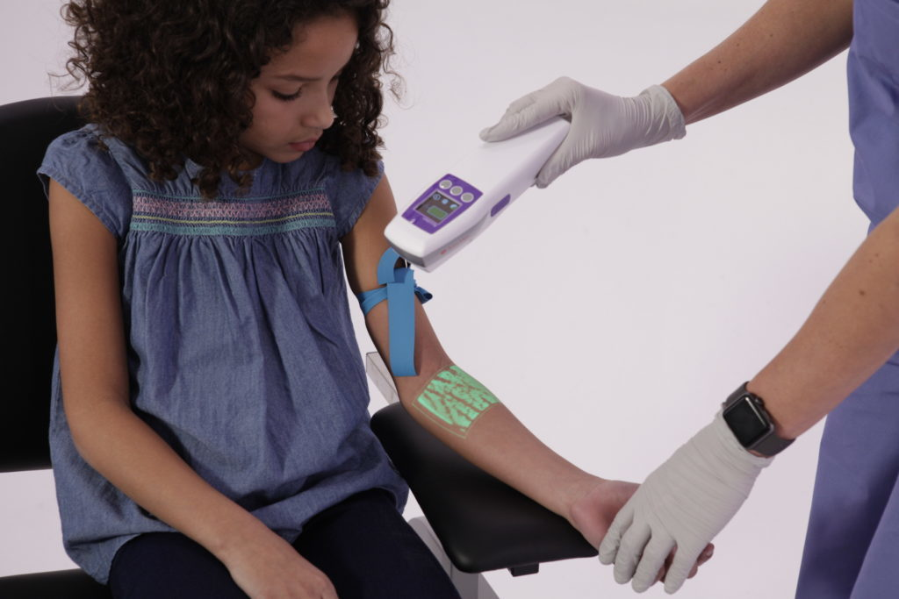

# Joe Zott

## Medical products I developed

### AccuVein AV500
https://www.accuvein.com/products/catalog/av500-vein-viewing-system/

### Other AccuVein products
- AV400
- AV300

## My Product Awards

2014 SPIE Prism Award Winner Life Sciences and Biophotonics for AV400

2013 Gold Winner Medical Device Excellence Award Critical-Care and Emergency Medicine Products for AV400

2010 Gold Winner Medical Device Excellence Award Critical-Care and Emergency Medicine Products for AV300

## My augmented Reality press

[Augmented Human: 5 Times I’ve Used Technology To Augment Myself](https://www.forbes.com/sites/cathyhackl/2020/07/05/augmented-human-5-times-ive-used-technology-to-augment-myself)

[A Manager’s Guide to Augmented Reality](https://hbr.org/2017/11/a-managers-guide-to-augmented-reality)

[The future of augmented reality in healthcare](https://healthmanagement.org/c/healthmanagement/issuearticle/the-future-of-augmented-reality-in-healthcare)

[Why Your Business Should Pay Attention To Augmented Realty](https://www.forbes.com/sites/forbestechcouncil/2017/10/12/why-your-business-should-pay-attention-to-augmented-realty/)

## More about Joe Zott
Engineering executive with broad technical, business and market experience. Expert in rapidly putting together virtual teams to exploit business opportunities as well as manage teams for long term profitability and customer satisfaction.

Proven ability to deliver products under tight budget and schedule constraints with demanding specifications. Demonstrated team builder able to form and manage high performance teams. Able to act as a strong individual technical contributor with extensive software, electrical, semiconductor, systems, and mechanical engineering as well as program management experience. Proven experience in enabling marketing and sales teams to meet corporate business goals.

[LinkedIn](https://www.linkedin.com/in/joe-zott-1bb3111/)

Specialties: Medical devices
Handheld products
Electro-optics
Consumer electronics
Wireless - consumer, industrial, defense intelligence
Mobile computers
Product design
Algorithms and implementations (video, audio, and radio)
Software (big & small) (architecture through code and test)
Security
Mixed signal semiconductor design
Network protocols 
